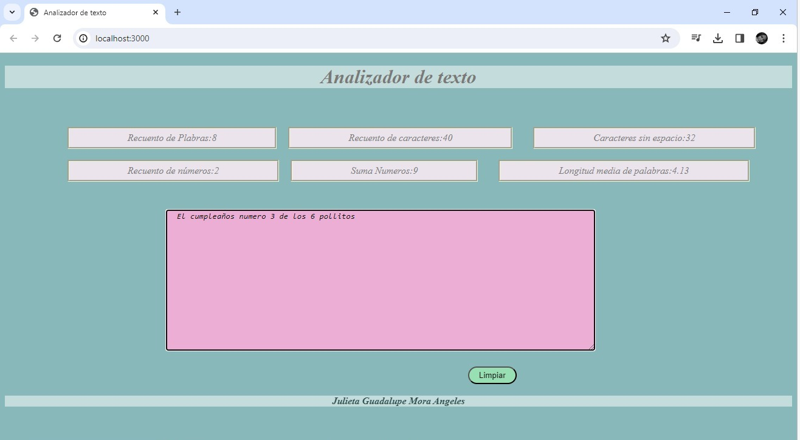

# Analizador de texto

## Objetivo
Realizar un analisis de datos de manera especifica con caracteres, 
numeros y palabras, permitiendo al usuario observar su texto de 
 forma cuantificada.Haciendo posible que el ususario pueda corregir 
* el texto segun sus caracteres, palabras y numeros  deseados.
## Contenido

* [Objetivo](#-Objetivo)
* [Demo](#-Demo)
* [Carcteristicas](#-Carcteristicas)
* [Autora](#-Autora)

***

## Demo

## Carcteristicas

1. La aplicación debe permitir a la usuaria ingresar un texto escribiéndolo
en un cuadro de texto.

2. La aplicación debe calcular las siguientes métricas y actualizar el
resultado en tiempo real a medida que la usuaria escribe su texto:

    - **Recuento de palabras**: la aplicación debe poder contar el número de
    palabras en el texto de entrada y mostrar este recuento a la usuaria
    - **Recuento de caracteres**: la aplicación debe poder contar el número de
    caracteres en el texto de entrada, incluidos espacios y signos de
    puntuación, y mostrar este recuento a la usuaria.
    - **Recuento de caracteres excluyendo espacios y signos de puntuación**:
    la aplicación debe poder contar el número de caracteres en el texto de
    entrada, excluyendo espacios y signos de puntuación, y mostrar este recuento
    a la usuaria.
    - **Recuento de números**: la aplicación debe contar cúantos números hay en
    el texto de entrada y mostrar este recuento a la usuaria.
    - **Suma total de números**: la aplicación debe sumar todos los números que
    hay en el texto de entrada y mostrar el resultado a la usuaria.
    - **Longitud media de las palabras**: la aplicación debe calcular la
    longitud media de las palabras en el texto de entrada y mostrársela a la usuaria.

3. La aplicación debe permitir limpiar el contenido de la caja de texto haciendo
clic en un botón.
## Autora 
Julieta Mora de Laboratoria 